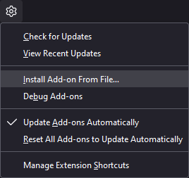
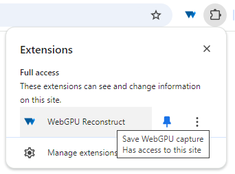

# Capturing content
WebGPUReconstruct provides a browser extension that can capture the WebGPU commands being issued by a web page. The commands will be stored in a `.wgpur` capture file which can later be [replayed using the native replayers](REPLAYING.md).

## Installing the browser extension

### Desktop
WebGPUReconstruct has been tested in [Chrome](https://www.google.com/chrome/), [Edge](https://www.microsoft.com/en-us/edge) and Firefox [Nightly](https://www.mozilla.org/en-US/firefox/channel/desktop/#nightly)/[Developer Edition](https://www.mozilla.org/en-US/firefox/developer/). Other Chromium-based browsers should also work in theory.

#### Chromium (Chrome, Edge, etc.)
- Go to your extension settings.
- Enable the developer mode checkbox.

  
- Click on `Load unpacked`.
- Select the `build/capture/chromium` folder.

#### Firefox Nightly/Developer Edition
- Go to `about:config`.
- Disable `xpinstall.signatures.required`. This will allow you to install extensions that haven't been signed by Mozilla.
- Go to your extension settings (`about:addons`).
- Click on the cog wheel and select `Install Add-on From File...`

  
- Select the `build/capture/firefox.zip` file.

##### Alternative: Temporary add-on
If you don't want to enable installing extensions that haven't been signed by Mozilla, you can install the capture extension as a temporary debug add-on. Temporary add-ons are removed when quitting the browser, so you'll have to reinstall it whenever you want to use it.
- Go to `about:debugging`.
- Go to the `This Nightly`/`This Firefox` tab.
- Click on `Load Temporary Add-on...`
- Select the `build/capture/firefox/manifest.json` file.

### Android
Most Android browsers don't support extensions. However, WebGPUReconstruct has been tested to work with [Lemur](https://play.google.com/store/apps/details?id=com.lemurbrowser.exts) and [Firefox Nightly for Developers](https://play.google.com/store/apps/details?id=org.mozilla.fenix).

#### Lemur
- Transfer `build/capture/chromium.zip` to the Android device (eg. using `adb push`).
- Open Lemur and go to the extension settings.
- Press `Load *.zip/*.crx/*.user.js file.`.
- Locate the zip file and select it.

When capturing content, Lemur tends to add `.txt` to the capture file. Just rename the files to `.wgpur` and they will work.

#### Firefox Nightly for Developers
- Transfer `build/capture/firefox.zip` to the Android device (eg. using `adb push`).
- Go to Settings->About Firefox Nightly.
- Press the Firefox logo 5 times to enable the debug menu.
- Go to `about:config`.
- Disable `xpinstall.signatures.required`. This will allow you to install extensions that haven't been signed by Mozilla.
- Go to Settings->Install extension from file. (This option is only available if the debug menu has been enabled.)
- Locate the zip file and select it.

## Capturing content
Open the web page you want to capture. WebGPUReconstruct will automatically start capturing all WebGPU commands being issued by the web page. When you have a good amount of frames, press the WebGPUReconstruct button to finish the capture and save it to a file. (You can pin the button for easier access.)

The file will be treated as a file download. Locate it wherever your browser stores downloaded files.

## Disabling the extension
The browser extension will run on all web pages, even ones which don't use WebGPU. It *will* affect both CPU and GPU performance. It is strongly recommended to disable the extension during regular web browsing and only enable it when you want to capture WebGPU content. You don't need to uninstall the extension to disable it. Both Firefox and Chromium browsers provide a checkbox next to the extension which can be used to quickly toggle it on/off.

Note that after enabling the extension you will need to reload any web page you want to capture.